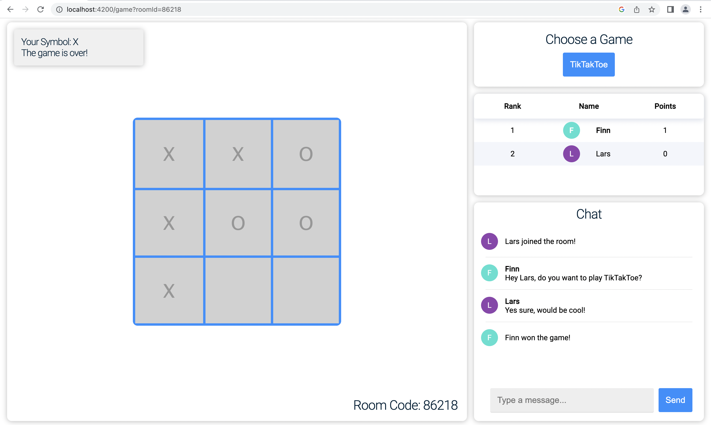
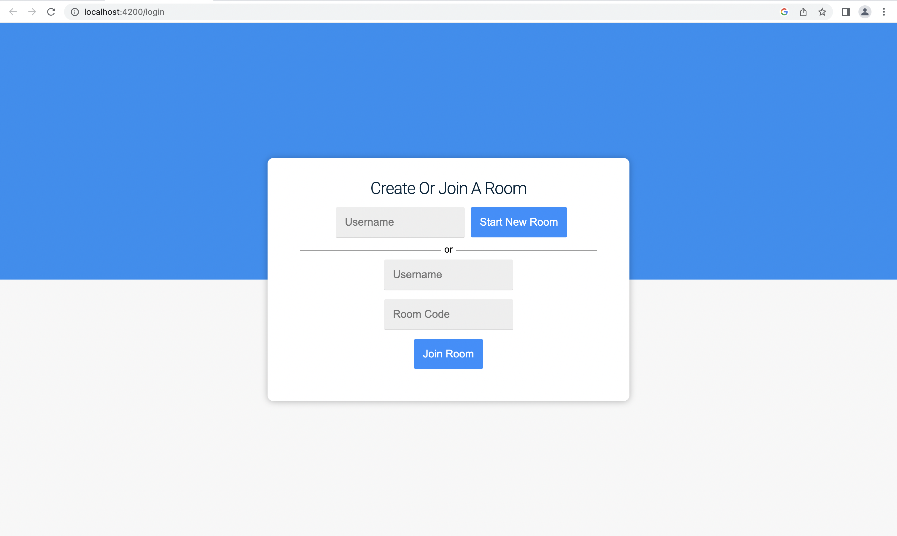

# Customisable Multiplayer Online Game



The purpose of this project is to provide a base project for online multiplayer games.
All the communication is handled automatically, only the frontend and backend
logic for the new game have to implement.
<br>
The frontend uses Typescript and Angular, while the backend uses Java, Springboot and maven. For communication between the front- and backend Sockets and Stomp are used.
Users do not interact directly with each other, only through the backend.
<br>
<br>
This readme is still a work in progress, I hope I can add an example of how to add a game soon.

## Features

- A user can either create a new Room or join an existing Room
- Rooms are independent of each other and are identified by their room code
- Before a user enters a new room, the user who created the room will get a notification in the chat window asking him if the user can join
    - if the first user left the room, a random user will be chosen to decide if a new user can join
- the left area is the area in which you have to design your game
- the right top area lets the user pick a game by clicking on the name
    - your game will automatically appear here
- The area underneath shows the score board
    - new users are added automatically and points are also added automatically
    - if users leave the room, they are also removed automatically
- The area in the bottom right is the chat area
    - if a user wants to join, the message to accept or deny him will appear here for one
    user in the room
    - Every user will be informed if a user joins or leaves the room
    - Users can be informed if a user won the game
    - chat messages can be exchanged here

## Run the Application
The backend needs to be executed before the frontend 

### Backend
The backend was build with java jdk-11.0.13 and Springboot.
Navigate into the backend folder and assuming you have maven installed,
the application can be started with:

```bash
$ mvn spring-boot:run
```

### Frontend
To run the frontend you need to have node, npm and angular installed installed.
Navigate into the frontend folder an run

```bash
$ npm install
$ ng serve
```

Then open your browser at localhost:4200.

## Add a New Game
The format of communication between your frontend and backend can mostly be
designed freely.
The only specification is, that the format is JSON interpretable and it 
must contain a field called "game_name".
The value of this field should be the exact same as the class name for the game which
you are implementing in the backend. Everything afterwards is up to you. E.g.

```json
{
    "game_name": "TikTakToe",
    ...
}
```

### Backend
1. Add a new class under src/main/java/com/communication/backend/games
2. The name chosen has to be in CamelCase and must correspond with "game_name"
3. The class must extend from Game.java
4. Take a look at the methods in src/main/java/com/communication/backend/games/Game.java which you have to implement. Everything is explained in more detail here.

### Frontend
1. Add a new angular component under frontend/src/app/components/games
2. The name chosen must be in kebab-case and must correspond with "game_name"
    1. TikTakToe -> tik-tak-toe
3. make your class extend from Game
4. go to frontend/src/main/components/choose-game/choose-game.component.ts
    1. add your game to availableGames:
    ```typescript
        availableGames: {displayName: string, internalName: string}[] = [
            ..,
            {
            displayName: "", // The name for the game you want to show in the UI,
			internalName: "", // must be game_name,
            }
        ]
    ```
5. The name chosen has to be in CamelCase and must correspond with "game_name"
6. implement your-game.component.ts and your-game.component.html
    1. take a look at frontend/src/app/models/game.ts to check what methods need to be implemented
    2. The constructor for your class must take the CommunicationService and DataService as arguments which need to be given to the super class.
    3. When the player makes a move and you want to send your game update to the backend call the updateGame method from the CommunicationService


## Dependencies
to be added